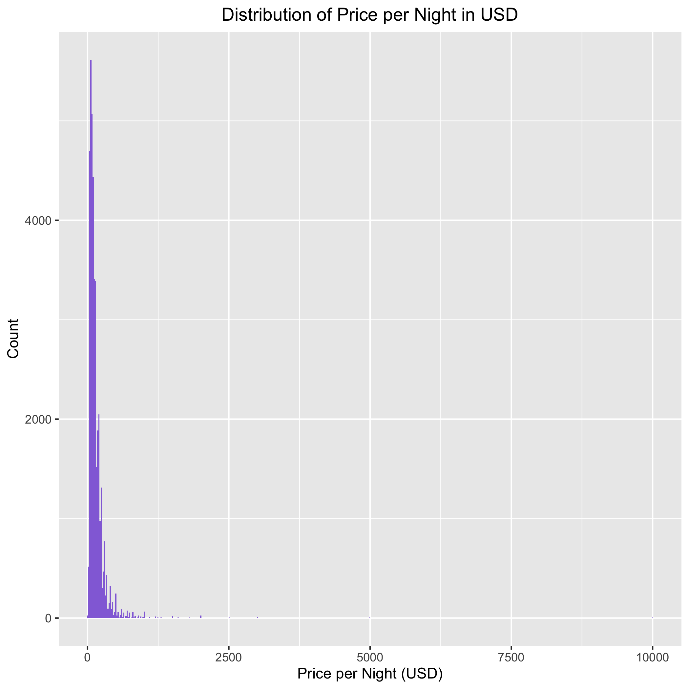
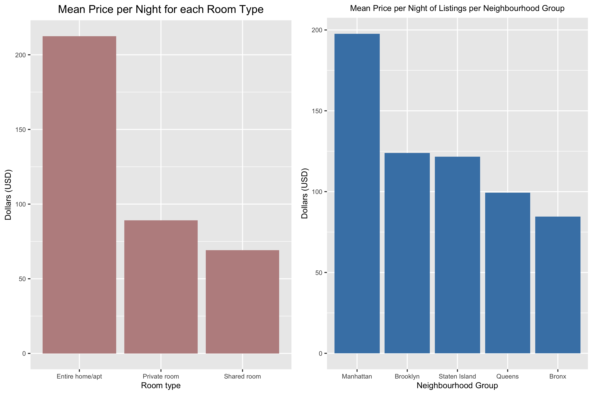
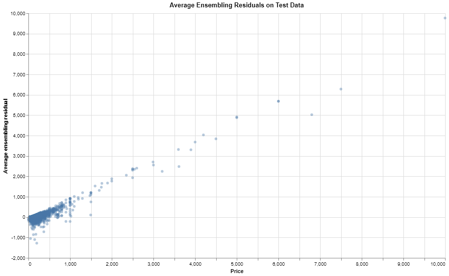
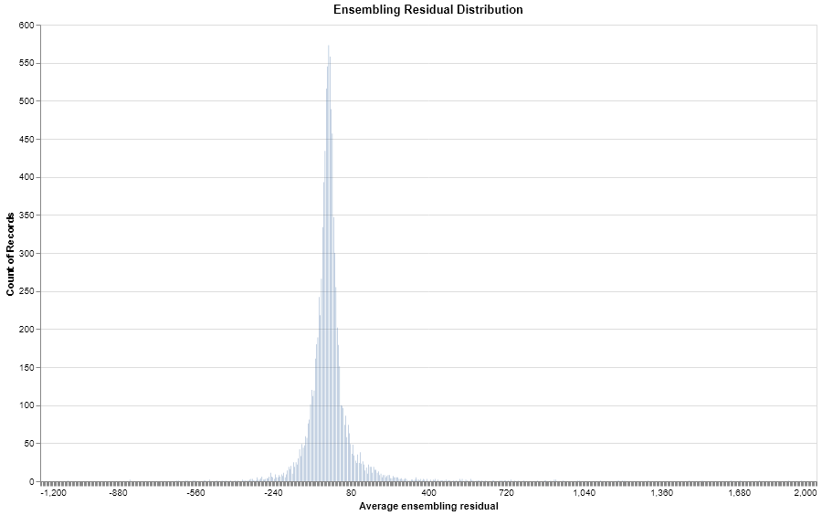

```{r setup, include=FALSE}
knitr::opts_chunk$set(echo = FALSE)
library(knitr)
library(tidyverse)
```

# Summary

In this project, our team attempted to predict Airbnb prices in New York by testing several tree-based algorithms and finding the best performing model. The models used in this project were: Random Forest, XGBoost, LightGBM and an average ensembling of the three algorithms, and evaluated by Mean Absolute Error. The average ensembling of Random Forest, XGBoost and LightGBM was the best performing model with a Mean Absolute Error of $63.81.

# Introduction

We aim to investigate what would be the appropriate or comparable price for a future Airbnb listing in the New York in 2020, given the same set of listing features from the dataset. New York is one of the most visited cities in the world, with a predicted 67 million tourists visiting in 2019 [@mcgeehan_2019] and 65 million tourists [@mcgeehan_2018] visiting in 2018. With Airbnb’s popularity continuing to rise and its disruption of the hotel industry, more people are staying in Airbnb’s, as 500 million stays in an Airbnb have occurred since 2008 [@sherwood_2019], the company’s founding.  With the popularity of both New York as a tourist attraction and Airbnb, being able to predict the price of an Airbnb in New York, given the same set of listing features from the dataset, would be extremely useful. An accurate and reasonable price prediction for a listing would be helpful for New York hosts, especially new hosts, to set their prices correctly. 


# Data

The dataset used in this project is about Airbnb listings in New York in 2019. The Airbnb listing data is coming directly from Airbnb, as posted on the company's [site](http://insideairbnb.com/get-the-data.html)[@GettheDa10:online]. Each of the 48,895  rows represents an Airbnb listing, which includes several features, such as the price of the listing, neighbourhood, room type and number of reviews. 


Figure 1. Correlation and distribution plots for numerical features




Figure 2. Distribution of New York Airbnb prices per night in 2019




Figure 3. Mean New York Airbnb prices per night based by room type and neighbourhood group in 2019


```{r message = FALSE, warning= FALSE}
table_1 <- read_csv("../results/tables/summary-table.csv")
kable(table_1)
```


Table 1. Summary of number of listings, mean price and maximum price for Airbnb's in New York in 2019.




Figure 4. Average ensembling residuals on test data



Figure 5. Ensembling Residual Distribution


```{r message = FALSE, warning=FALSE}
table_2 <- read_csv("../results/tables/feature_importance_table.csv")
table_2 <- table_2 %>% 
  rename(Model = X1)
kable(table_2)
```


Table 2. Feature importance for models

```{r message = FALSE, warning=FALSE}
table_3 <- read_csv("../results/tables/mean_absolute_error_table.csv")

table_3 <- table_3 %>% 
  rename(Model = X1, `Mean Absolute Error` = mean_absolute_error)
kable(table_3)
```


Table 3. Mean Absolute Error results for each model.

# References


