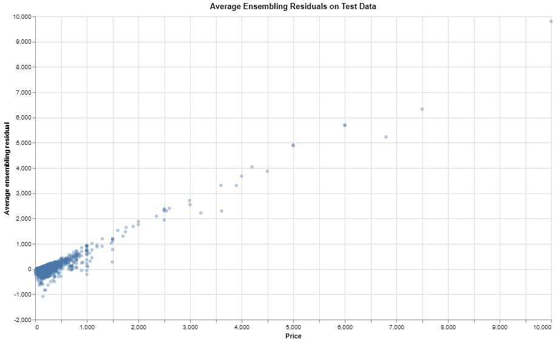

```{r setup, include=FALSE}
knitr::opts_chunk$set(echo = FALSE)
library(knitr)
library(tidyverse)
library(png)
```

# Summary

In this project, our team attempted to predict Airbnb prices in New York by testing several tree-based algorithms and finding the best performing model. The models used in this project were: Random Forest, XGBoost, LightGBM and an average ensembling of the three algorithms, and evaluated by Mean Absolute Error. The average ensembling of Random Forest, XGBoost and LightGBM was the best performing model with a Mean Absolute Error of $63.81.

# Introduction

We aim to investigate what would be the appropriate or comparable price for a future Airbnb listing in the New York in 2020, given the same set of listing features from the dataset. New York is one of the most visited cities in the world, with a predicted 67 million tourists visiting in 2019 [@mcgeehan_2019] and 65 million tourists [@mcgeehan_2018] visiting in 2018. With Airbnb’s popularity continuing to rise and its disruption of the hotel industry, more people are staying in Airbnb’s, as 500 million stays in an Airbnb have occurred since 2008 [@sherwood_2019], the company’s founding.  With the popularity of both New York as a tourist attraction and Airbnb, being able to predict the price of an Airbnb in New York, given the same set of listing features from the dataset, would be extremely useful. An accurate and reasonable price prediction for a listing would be helpful for New York hosts, especially new hosts, to set their prices correctly. 


# Data

The dataset used in this project is about Airbnb listings in New York in 2019. The Airbnb listing data is coming directly from Airbnb, as posted on the company's [site](http://insideairbnb.com/get-the-data.html)[@GettheDa10:online]. Each of the 48,895  rows represents an Airbnb listing, which includes several features, such as the price of the listing, neighbourhood, room type and number of reviews. 


Figure 1. Correlation and distribution plots for numerical features


Figure 2. Distribution of New York Airbnb prices per night in 2019


Figure 3. Mean New York Airbnb prices per night based by room type and neighbourhood group in 2019


```{r message = FALSE, warning= FALSE}
table_1 <- read_csv("../results/tables/summary-table.csv")
kable(table_1)
```


Table 1. Summary of number of listings, mean price and maximum price for Airbnb's in New York in 2019.




Figure 4. Average ensembling residuals on test data


Figure 5. Ensembling Residual Distribution


```{r message = FALSE, warning=FALSE}
table_2 <- read_csv("../results/tables/feature_importance_table.csv")
table_2 <- table_2 %>% 
  rename(Model = X1)
kable(table_2)
```


Table 2. Feature importance for models

```{r message = FALSE, warning=FALSE}
table_3 <- read_csv("../results/tables/mean_absolute_error_table.csv")

table_3 <- table_3 %>% 
  rename(Model = X1, `Mean Absolute Error` = mean_absolute_error)
kable(table_3)
```


Table 3. Mean Absolute Error results for each model.

# Our chosen models, metric and why

For our prediction, we have chosen Random Forest, XGBoost, and LightGBM as our models; also, we have picked mean absolute error as our metric and average ensembling as our final prediction. We have decided to pick only ensemble tree-based algorithms because they generally have better predictive performances than other regressors, such as linear regression. Furthermore, the feature, neighborhood, has over 200 categories, and the only models that can process it with labels are tree-based. Otherwise, we would have to encode it and hence face high cardinality problems. Moreover, based on our exploratory data analysis, we have decent confidence that tree-based models can figure out prices based on the existing features. The primary value of our models is to provide early Airbnb users with reasonable prices on their listings so that they can get them up and running quickly and effectively. To maximize this value, we average the model predictions as an ensemble for the final predicted prices. For the same reason, we use mean absolute error as our performance metric instead of mean squared error because we want to optimize more for median than mean. Mean is more impacted by outliers than the median, and we think aiming for median rather than mean will produce more of a reasonable price for potential customers, efficiently paving the way to the new hosts' first bookings.

# Our modelling result

We built three models, Random Forest, LightGBM, and XGBoost, and averaged their predictions to produce the final productions. We derived all models with some degree of hyperparameter tuning. The Random Forest and XGBoost regressors both took considerably longer to train than the LightGBM regressor, and that is why we limited their combinations of hyperparameters for tuning due to our time constraint. 

```{r model mean absolute error}
read.csv('../results/tables/mean_absolute_error_table.csv', row.names = 1)
```

Despite the fact that the models have imbalanced hyperparameter tuning, they have comparable results and are all an obvious upgrade over the median null model. Moreover, the ensemble has a decent performance improvement over the base models. 

Let us look at the feature importances of different models. 

```{r Model mean absolute error}
read.csv('../results/tables/feature_importance_table.csv', row.names = 1)
```

Except longitude, no other feature seems to be consistantly important for all models. For instance, the top three features for the Random Forest regressor also include latitude and room type, while for the LightGBM regressor, they are the amount of days available per year, minimum nights and latitude. However, for the purpose of our goal, interpreting feature importance is not our focus.

Let us look at the ensemble residuals on the test set.

```{r ensemable residual plot}

```

```{r ensemable residual distribution}
include_graphics('../results/plots/ensemble_residual_distribution.png')
```

The residuals look to follow a normal distribution with a few big residuals spread along the high prices. We do not quite care about those big residuals over high prices because we intend our model to estimate the median. In particular, we do not want our model to be affected or swayed by high prices by too much since pulling the predictions towards that direction will hinder the listings' ability to get bookings quickly and hence discourage new hosts from maintaining those listings. In conclusion, we believe our ensemble has done its job effectively.

# Limitations

# References
